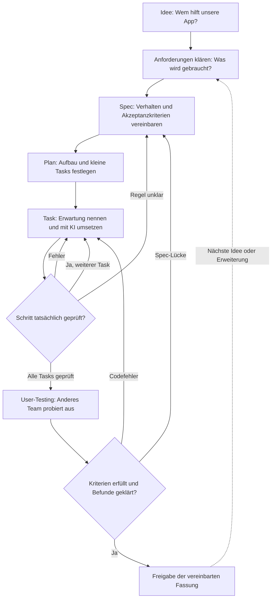

# Software-Engineering erlebbar machen

## 1. Die Grundidee

**Mit SDD erleben Schüler, wie aus einer Idee überprüfbare Software entsteht.** Sie klären Anforderungen, vereinbaren gewünschtes Verhalten, planen eine Lösung, setzen kleine Arbeitspakete mit KI um und prüfen das Ergebnis. Die KI unterstützt durch Rückfragen, Vorschläge, Code und Erklärungen. Schüler entscheiden, begründen und verstehen.

Spec-Driven Development bedeutet hier: Eine kurze, gemeinsam geprüfte **Spezifikation steuert die Entwicklung**. Sie verbindet Nutzerbedarf, Umsetzung und Prüfung. Das Lernziel ist der Zusammenhang der Tätigkeiten im Softwareentwicklungsprozess; die Promptfolge hilft, ihn praktisch zu erleben.[^sdd]

> [!MERKE] Der verbindliche Kern
> **Eigene Erwartungen vor der Umsetzung festlegen und das Ergebnis nach jedem Schritt tatsächlich prüfen.** TDD bleibt eine optionale Vertiefung. Für die Freigabe probieren Mitschüler die Anwendung aus.

Die Stationen strukturieren den Einstieg. Rückmeldungen führen zu Korrekturen und neuen Durchläufen. Testfälle werden schon beim Klären der Anforderungen bedacht.[^prozess]

## 2. Was Schüler dabei lernen

Für den ersten Durchlauf genügen drei Lernziele: eine vage Anforderung an Beispielen präzisieren, Erwartung und Beobachtung vergleichen, eine Kernfunktion erklären. Weitere Begriffe entstehen am Projekt und werden anschließend im [Glossar](glossar.md) benannt.

| Tätigkeit | Beispiel: Binärzahl-Trainer |
| --- | --- |
| Use Case und Anforderungen | Ein Mitschüler übt die Umwandlung von `1011` in eine Dezimalzahl und braucht hilfreiche Rückmeldung. |
| Spec und Akzeptanzkriterien | `11` ergibt „Richtig“; eine falsche Zahl einen Stellenwerthinweis; eine leere Eingabe eine verständliche Aufforderung. |
| Architekturentscheidung | Eingabe lesen, Antwort fachlich prüfen und Rückmeldung anzeigen erhalten getrennte Zuständigkeiten. Die Fachfunktion lässt sich ohne Oberfläche prüfen. |
| Plan und Tasks | Eingabe und Fachfunktion verbinden; Hinweise ergänzen; leere Eingabe behandeln. Jeder Task hat eine passende Prüfung. |
| Testen und Freigabe | Eigene Fälle ausführen; einen Mitschüler eine falsche Antwort ausprobieren lassen; Befunde bearbeiten und über die Fassung entscheiden. |

Ein Schüler soll mindestens einen Zusammenhang **Anforderung → Kriterium → Code → Prüffall** erläutern können. Der vollständige Fachwortschatz ist kein Vorwissen und kein zusätzlicher Prüfungskatalog.

## 3. Vorbereitung: eine Projektkarte ausfüllen

Wählen Sie einen überschaubaren Auftrag aus der [Aufgabensammlung](aufgaben.md). Voraussetzung sind grundlegende Variablen, Bedingungen, Schleifen und einfache Funktionen; fehlende Grundlagen werden vorbereitet. Listen/Arrays werden erst nach Einführung verwendet. Für den Zahlensystem-Trainer müssen binäre Stellenwerte bekannt sein.

Die folgende Karte wird an Schüler und KI gegeben. Vorgaben des Schulfrontends können vorausgefüllt sein.

| Feld | Vor Ausgabe ausfüllen |
| --- | --- |
| Auftrag und Nutzer | … |
| Erste Fassung und spätere Wünsche | … / … |
| Format und Entwicklungszeit | KURZ / PROJEKT; … Unterrichtsstunden |
| Sprache, Umgebung, Gerüst | …; bereitgestellte Dateien: … |
| Start und Prüfung | App starten: …; Prüffälle ausführen: … |
| Bekannt / neu / freigegeben | … / … / … |
| Zu erklärende Kernfunktion | …; bereitgestellte Infrastruktur: … |
| Individueller Nachweis | Form, Kriterien und Zeitfenster: … |
| TDD | Nicht vorgesehen / Demonstration / begleiteter Zyklus |
| Abgabe | Ort und Termin: … |

**Vorab einmal praktisch durchspielen:** Gerüst starten, Codeübertragung testen und mit dem tatsächlichen Schulfrontend einen kleinen Task bearbeiten. Kann die KI knapp nachfragen, auf echte Ergebnisse warten und verständlichen Code erzeugen? Das Modellverhalten muss beobachtet werden.

Die [Prompt-Anleitung](prompts/index.md) beschreibt die Einrichtung. Grundregeln und Karte können vom Frontend mitgegeben oder in den Chat kopiert werden. Der Chat sieht lokale Dateien und Ausführungen nicht automatisch. Schüler speichern, starten und melden tatsächliche Ausgaben zurück.

Eine separate Spec-Datei ist entbehrlich, wenn die bestätigten Verhaltensregeln und Kriterien bereits im Chat, in `projekt.md` oder in einem vollständigen Task stehen. Der Kontext muss vom Frontend tatsächlich weiter mitgesendet werden. Die Prompt-Anleitung erläutert die Übergabe bei gleichem und neuem Chat.

## 4. Unterricht in zwei Zeitformaten

Alle Zeiten sind Planungsansätze. **KURZ:** ein erstes Ergebnis in ein bis zwei Doppelstunden. **PROJEKT:** etwa fünf bis sechs Doppelstunden für mehrere Durchläufe; individuelle Nachweiszeit nach Klassengröße gesondert einplanen. TDD kann in beiden Formaten gewählt oder ausgelassen werden.

### KURZ: ein kleiner vollständiger Durchlauf

Empfohlener Zuschnitt: feste Binärzahl `1011`, Dezimalantwort prüfen, hilfreiche Rückmeldung und leere/ungültige Eingabe behandeln. Zufall, Fortschrittsanzeige und Arrays werden zunächst weggelassen. Die kurze Projektseite aus dem [Schüler-Arbeitsblatt](schuelerarbeitsblatt.md) hält Spec, Mini-Plan und Prüfungen zusammen.

| Minuten | Schülerhandlung |
| --- | --- |
| 0–10 | Nutzerproblem verstehen; `1011` selbst in Dezimal umrechnen |
| 10–25 | Mit KI Anforderungen klären; eigene Fälle und Erwartungen vereinbaren |
| 25–35 | Mini-Plan und Zuständigkeiten lesen; zwei bis drei kleine Tasks festlegen |
| 35–65 | Tasks einzeln umsetzen, lokal ausführen und nach jedem Schritt vergleichen |
| 65–80 | Anderes Team ausprobieren lassen; wichtigsten Befund bearbeiten |
| 80–90 | Über Freigabe entscheiden; Kernfunktion und eine Entscheidung erläutern |

Bei Problemen Umfang reduzieren oder mehr Zeit geben. Ein laufendes Produkt nach 90 Minuten ist kein Versprechen. Eine zweite Doppelstunde schafft Raum für Korrekturen, einen neuen Prüffall, Verständnisaufgaben und eine kleine Erweiterung. Optional lässt sich ein automatisierter Test oder TDD ergänzen.

### PROJEKT: denselben Zyklus vertiefen

| Abschnitt | Planungsansatz |
| --- | --- |
| Kleiner erster Durchlauf | 1 Doppelstunde |
| Anforderungen und Struktur vertiefen | 1 Doppelstunde; Normal-, Fehler- und Grenzfälle, kleine Architekturzeichnung |
| Tasks umsetzen und prüfen | 1–2 Doppelstunden; optional neue Datenstruktur oder TDD |
| User-Testing, Korrektur und Änderung | 1 Doppelstunde; mindestens einen Befund nachvollziehbar bearbeiten |
| Verständnis und Reflexion sichern | 1 Doppelstunde; individuelle Nachweise gegebenenfalls zusätzlich |

Eine gemeinsame `projekt.md` genügt. Bei größerem Umfang können Spec und Plan auf zwei Dateien verteilt werden. Tasks stehen im Plan, Ergebnisse bei den Prüffällen. Ein zusätzliches Review-Dokument ist nicht erforderlich.

## 5. Begleiten und vereinfachen

**KI-Dialog:** Erwartungen und Entscheidungen werden beim Klären der Anforderungen gewonnen und während der Umsetzung weiterverwendet. Fehlendes gezielt klären, neue APIs kurz am Beispiel erklären. Zusätzliche Verständnis-/Transferfragen höchstens einmal pro Projekt, sofern die Lehrkraft keine weiteren festlegt; keine Abfrage nach jedem Task. Bei Schwierigkeiten helfen. Forschung zu KI-Code legt eine bewusste eigene Auseinandersetzung nahe; diese Dosierung ist eine Unterrichtsentscheidung zur Erprobung.[^lernen]

**Code:** einfache Werte, Bedingungen, Schleifen und kurze benannte Funktionen; Eingabe, Fachlogik und Ausgabe erkennbar trennen. Zusätzliche Sprachmittel benötigen Einführung und Freigabe. Vorbereitete Infrastruktur wird kenntlich gemacht; Schüler erklären deren Verbindung zur Kernfunktion.

**Teams:** zwei bis drei Personen, wechselnde Aufgaben: eine Person formuliert, eine prüft, eine erklärt; bei zwei Personen kombinieren. Jede Person liefert eigene Erwartungen und erklärt einen ausgewählten Zusammenhang.

| Beobachtung | Hilfreiche Reaktion |
| --- | --- |
| Alles wird ungeprüft bestätigt | Eigenen Fall und begründete Entscheidung verlangen |
| Fragen oder Code überfordern | Umfang verkleinern; ein konkretes Beispiel bearbeiten |
| Tests bestehen, App wirkt falsch | Erwartung unabhängig herleiten; laufende App ausprobieren |
| KI behauptet Erfolg | Tatsächliche Ausgabe oder Beobachtung einfordern |
| Dokumentation verdrängt Entwicklung | Nur Entscheidungen, Tasks und Prüfergebnisse festhalten |

## 6. Prüfen, freigeben und Lernleistung sehen

Zum Abschluss erhält ein anderes Team Zweck, einen typischen Anwendungsfall und einen Fehler- oder Grenzfall. Es probiert die App aus und meldet eine konkrete Beobachtung. Die Entwickler ordnen sie ein: **Codefehler korrigieren, unklare Anforderung klären, neuen Wunsch für später notieren.** Diese kurze Nutzungserprobung verbindet Funktionsprüfung und Rückmeldung zur Verständlichkeit; ein professioneller Usability-Test wäre umfangreicher.

Freigabe heißt im Unterricht: Die vereinbarten Kriterien wurden geprüft, wesentliche Befunde geklärt und verbleibende Einschränkungen benannt. Ein Mensch trifft die Entscheidung. Bestehende Tests beweisen keine vollständige Fehlerfreiheit.[^testen]

Produktqualität und individuelle Lernleistung werden getrennt betrachtet. Legen Sie vorab die passende Nachweisform fest: etwa eine kurze schriftliche Vorhersage mit Begründung und eine kleine Änderungsaufgabe, ergänzt durch mündliche Rückfragen. Ein ausführliches Codeinterview ist eine Option. Bei 30 Personen und sechs Minuten einschließlich Wechsel benötigt es 180 Minuten; diese Zeit fällt auch bei Verteilung über Projektstunden an.

| Dimension | Beobachtbare individuelle Leistung |
| --- | --- |
| Anforderungen | Präzisiert eine Aussage anhand eigener Beispiele |
| Verständnis | Erklärt Kernfunktion und verfolgt eine neue Eingabe |
| Prüfung | Begründet Erwartung und vergleicht sie mit dem Ergebnis |
| Prozess | Erklärt eine Entscheidung oder Änderung und ihre Folgen |

KI-Hilfe ist bei der Vorbereitung erlaubt. Im kurzen individuellen Nachweis antwortet der Schüler selbst; Code darf sichtbar bleiben. Zeigen und Skizzieren sind zulässig. Notieren Sie „selbstständig“, „mit Hilfe“ oder „noch nicht gezeigt“. Codeumfang, Promptzahl und glänzende KI-Dokumente belegen kein Verständnis.

**Kurzer Rückblick:** Welche Rückfrage half? Welche Entscheidung traf ich? Was zeigte die Prüfung? Was würde ich früher klären? Für die Erprobung reichen Notizen zu Zeit, häufigen Hilfen und Verständnisproblemen.

## 7. Nur bei Bedarf nachlesen

Das [Glossar](glossar.md) erklärt die Begriffe. [Testen und TDD](vertiefung/testen-und-tdd.md) ergänzt Unit-, Integrations- und E2E-Tests sowie ein praktisches Beispiel. [Quellen und Begründung](vertiefung/quellen-und-begruendung.md) trennt Fachgrundlagen, Studienbefunde und eigene Unterrichtsentscheidungen.

[^sdd]: GitHub, [Spec Kit](https://github.github.com/spec-kit/), technische Primärquelle, geprüft am 04.10.2026. Das Unterrichtsmodell vereinfacht den technischen Workflow.
[^prozess]: IEEE Computer Society, [SWEBOK V4: Themenübersicht](https://www.computer.org/education/bodies-of-knowledge/software-engineering/topics), insbesondere Anforderungserhebung, Analyse, Spezifikation, Validierung und iterative Anforderungsarbeit; geprüft am 04.10.2026 über die indexierte offizielle Übersicht.
[^lernen]: Prather et al. (2024), [The Widening Gap](https://arxiv.org/abs/2405.17739); Kazemitabaar et al. (IUI 2025), [Cognitive Engagement Techniques](https://arxiv.org/abs/2410.08922). Aussagegrenzen stehen im Quellenanhang.
[^testen]: ISTQB, [CTFL Syllabus v4.0.1](https://istqb.org/?download_id=3345&sdm_process_download=1), Abschnitte 1.3 und 2.2; geprüft am 04.10.2026.
