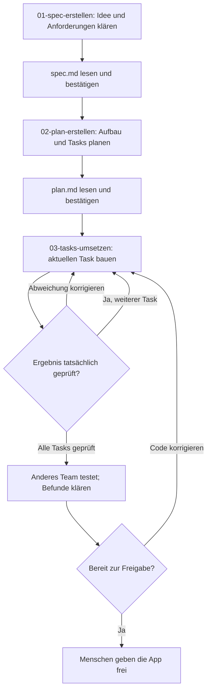

# Von unserer Idee zur geprüften App

**Wir entscheiden, die KI hilft, wir prüfen wirklich.** SDD gibt Orientierung bei neuen oder unklaren Aufgaben. Die vollständige vereinbarte App ist das Ziel; kleine Tasks machen den Weg überschaubar.

Die benötigten Dateien und Start-Eingaben stehen im [Prompt-Index](prompts/prompts-index.md). Übernehmt die Projektkarte der Lehrkraft. Begriffe erklärt das [Glossar](glossar.md).

Wenn eine Anforderung unklar ist, klärt sie zuerst und passt Spec, Plan und Prüfungen an. Die Phasenwechsel startet ihr selbst; innerhalb der Umsetzung begleitet die KI alle Tasks.

## 1. Vereinbaren und planen

- **Spec:** Für wen bauen wir was? Welche Eingaben, Ergebnisse und Regeln gelten? Nennt eigene Beispiele mit erwarteten Ergebnissen und wenige wichtige Fehler-/Grenzfälle. Sagt anschließend: „Erstelle jetzt unsere Vereinbarung.“ Lest, korrigiert und bestätigt die `spec.md`.
- **Plan:** Besprecht ein bis zwei sinnvolle Entscheidungen zur Aufteilung oder Reihenfolge. Versteht Dateien, Zuständigkeiten und Tasks, bevor ihr die `plan.md` bestätigt.

Beide Dateien stellt ihr später vor. Eine zusätzliche `task.md` braucht ihr nicht.

## 2. Alle Tasks umsetzen und prüfen

Startet den Umsetzungs-Prompt **einmal**. Vor jeder Änderung liegt eine konkrete Erwartung vor; vorhandene Beispiele aus der Spec werden weiterverwendet.

1. Code in die angegebene Datei übertragen und speichern.
2. App oder Test starten und Ergebnis mit der Erwartung vergleichen.
3. Tatsächliches Ergebnis an die KI melden; bei Abweichungen Eingabe, Erwartung, Ausgabe und betroffene Datei nennen.
4. Korrekturen erneut prüfen. Nach einem geprüften Task führt die KI zum nächsten weiter.

Mehrere Prüffälle dürft ihr gesammelt rückmelden. Die KI sieht euren Bildschirm und aktuelle Dateien nicht automatisch. Der Prüfstand bleibt in `plan.md`:

| Task / Kriterium | Eingabe oder Handlung | Erwartung | Tatsächliche Beobachtung |
| --- | --- | --- | --- |
| … | … | … | … |

> [!MERKE] Selbst ausführen
> „Funktioniert“ von der KI ist kein Prüfergebnis. Nach Änderungen auch betroffene bisherige Fälle erneut prüfen. Bei Fragen lasst euch eine konkrete Eingabe durch den Code erklären.

## 3. Andere ausprobieren lassen und freigeben

Gebt einem anderen Team den Zweck und eine typische Aufgabe. Lasst es auch einen Fehler- oder Grenzfall ausprobieren. Erklärt den Bedienweg zunächst nicht vor.

**Befund:** Eingabe/Handlung …; erwartet …; beobachtet …

**Unsere Reaktion:** Codefehler korrigieren / Anforderung klären / neuen Wunsch notieren. Danach betroffene Fälle erneut prüfen.

- [ ] Vereinbarte Kriterien tatsächlich geprüft.
- [ ] Wesentliche Befunde geklärt; offene Einschränkungen benannt.
- [ ] Kernfunktion und einen Prüffall selbst erklären können.

**Entscheidung:** freigegeben / nach Korrektur erneut prüfen.

## 4. Das eigene Verständnis zeigen

Die Lehrkraft kündigt den individuellen Nachweis an. Erkläre selbst: Welche Anforderung erfüllt die Kernfunktion? Wie verarbeitet sie eine neue Eingabe? Warum erwartest du dieses Ergebnis? Was müsste sich bei einer kleinen Regeländerung ändern?

**Rückblick:** Eine hilfreiche Rückfrage … / unsere wichtigste Entscheidung … / das zeigte eine Prüfung …

Optional: [Testen und TDD](vertiefung/testen-und-tdd.md) erklärt Test zuerst, Rot, Grün und Refactoring sowie Unit-, Integrations- und E2E-Tests.
