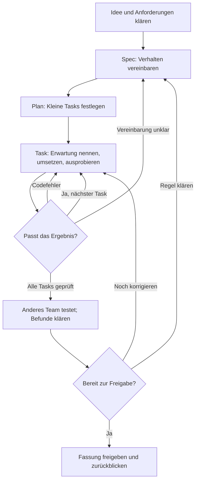

# Von unserer Idee zur geprüften Anwendung

## Drei Fragen begleiten uns

**Was soll unsere App für jemanden leisten? Woran erkennen wir richtiges Verhalten? Können wir die Lösung erklären?**

Die KI hilft beim Klären, Planen, Programmieren und Verstehen. Wir treffen Entscheidungen und führen App und Prüfungen selbst aus. Neue Begriffe können wir im [Glossar](glossar.md) nachschlagen.

> [!MERKE] Immer zuerst eine Erwartung
> Bevor die KI eine Funktion umsetzt, nennen wir eine konkrete Eingabe und das erwartete Ergebnis. Danach speichern und starten wir die App und vergleichen. Eine KI-Aussage „funktioniert“ ersetzt diese Prüfung nicht.

## 1. Idee und Anforderungen

Wählt den vorgegebenen [Auftrag](aufgaben.md) und übernehmt die ausgefüllte Projektkarte der Lehrkraft. Nutzt den [Spec-Prompt](prompts/02-spezifikation.md).

- Wer soll die App in welcher Situation nutzen?
- Was braucht diese Person? Was gehört in unsere erste kleine Fassung?
- Welche Regeln, Fehlerfälle oder Grenzen müssen wir klären?

Beispiel: „Die App hilft beim Lernen“ ist noch unklar. „Bei einer falschen Antwort zeigt sie einen Stellenwerthinweis“ beschreibt beobachtbares Verhalten. Entscheidet selbst, wie ein hilfreicher Hinweis aussehen soll.

## 2. Eine kurze Projektseite führen

Die Vorlage unten kann in eine `projekt.md` übernommen werden. Die KI darf beim Formulieren helfen; wir lesen und korrigieren ihre Vorschläge. Wenige verständliche Einträge genügen. Die Lehrkraft legt den Umfang fest.

### Spec – unsere Vereinbarung

- **Name, Zweck und Nutzer:** …
- **Erste Fassung:** …
- **Spätere Wünsche:** …
- **Eingaben, Ergebnisse und wichtige Regeln:** …
- **AK-1:** Wenn …, zeigt/tut die App …
- **AK-2:** …
- **AK-3:** …
- **Offene Fragen:** … / keine
- **Von uns inhaltlich bestätigt:** …

AK bedeutet Akzeptanzkriterium: eine beobachtbare Bedingung, an der wir die Erfüllung einer Anforderung prüfen. Eigene Beispiele ergänzen die Kriterien.

### Plan – Aufbau und kleine Tasks

Nutzt den [Plan-Prompt](prompts/03-plan.md). Versteht den Vorschlag, bevor ihr ihn bestätigt.

- **Dateien und Zuständigkeiten:** …
- **Eine wichtige Entscheidung und ihr Grund:** …
- **App starten / Prüfungen ausführen:** … / …
- **Task 1:** …; erfüllt AK-…; fertig, wenn …
- **Task 2:** …; erfüllt AK-…; fertig, wenn …
- **Weitere Tasks nur bei Bedarf:** …

### Prüffälle und Beobachtungen

Erwartungen vor der Umsetzung eintragen, Beobachtungen danach. Behält eine Änderung Einfluss auf bestehende Funktionen, prüfen wir deren Fälle erneut.

| Task / Kriterium | Eingabe oder Handlung | Vorher erwartetes Ergebnis | Tatsächliche Beobachtung |
| --- | --- | --- | --- |
| … | Typischer Fall: … | … | … |
| … | Fehlerfall: … | … | … |
| … | Grenze, falls passend: … | … | … |

### Eine wichtige Entscheidung oder Änderung

**Unklar war … / Wir haben entschieden … / Deshalb änderten wir … / Geprüft haben wir …**

## 3. Jeweils einen Task umsetzen

Nutzt den [Umsetzungs-Prompt](prompts/04-umsetzung.md) mit dem aktuellen Task. Vor der Änderung sagen wir eine Erwartung selbst voraus. Danach:

1. Code in die angegebene Datei übertragen und speichern.
2. App oder Test mit dem vereinbarten Verfahren starten.
3. Beobachtung mit unserer Erwartung vergleichen.
4. Bei Abweichung Datei, Eingabe, Erwartung und tatsächliche Ausgabe an die KI geben.
5. Korrektur prüfen; dann den nächsten Task beginnen.

Die KI sieht unsere lokalen Dateien und unseren Bildschirm nicht automatisch. Bei einer vollständigen Datei nur den Code übernehmen, keine Markdown-Zäune. Bei einer Teiländerung genau die benannte Stelle ersetzen. Für einen neuen Chat Projektkarte, Regeln, Projektseite und betroffene aktuelle Dateien mitgeben.

> [!TIPP] Wenn du etwas nicht verstehst
> „Verfolge die Eingabe … durch diese Funktion.“ – „Welche Anforderung erfüllt sie?“ – „Verwende unsere bekannten Sprachmittel.“ – „Gib mir einen neuen Fall, dessen Ergebnis ich selbst vorhersage.“

## 4. Andere ausprobieren lassen

Ein anderes Team bekommt den Zweck und eine typische Aufgabe. Es probiert auch einen Fehler- oder Grenzfall und sagt, ob die Rückmeldung verständlich ist. Die Entwickler erklären den Bedienweg zunächst nicht vor; beobachtet, wo Hilfe nötig wird.

- **Aufgabe für das andere Team:** …
- **Ein konkreter Befund:** Eingabe/Handlung …; erwartet …; beobachtet …
- **Unsere Einordnung:** Codefehler / unklare Anforderung / neuer Wunsch
- **Unsere Reaktion und erneute Prüfung:** …

Neue Wünsche dürfen in die nächste Fassung. Eine unklare Anforderung wird erst gemeinsam geklärt, dann werden Spec, Plan, Code und Prüffälle passend geändert.

## 5. Über die Freigabe entscheiden

- [ ] Unsere vereinbarten Kriterien wurden tatsächlich geprüft.
- [ ] Wesentliche Befunde wurden geklärt; offene Einschränkungen sind benannt.
- [ ] Wir können die vereinbarte Kernfunktion und einen passenden Prüffall erklären.

**Entscheidung:** freigegeben / nach Korrektur erneut prüfen.

**Verbleibende Einschränkung oder nächster Wunsch:** …

Freigabe bedeutet: Diese vereinbarte Fassung ist bereit. Sie bedeutet keine garantierte Fehlerfreiheit.

## 6. Das eigene Verständnis zeigen

Die Lehrkraft kündigt die Nachweisform an. Bereite dich mit KI vor. Im individuellen Nachweis erklärst du selbst; der Code darf sichtbar bleiben.

- Welche Anforderung erfüllt die Kernfunktion?
- Was geht hinein, wie werden Werte verarbeitet, was kommt heraus?
- Welche Ausgabe erwartest du bei einer neuen Eingabe – und warum?
- Was müsste sich bei einer kleinen Regeländerung ändern?

**Mein Rückblick:** Welche Rückfrage half mir? Welche Entscheidung traf ich? Was zeigte eine Prüfung? Was würde ich beim nächsten Durchlauf früher klären?

Optional: Wenn wir TDD verwenden

**Erwartung → Test zuerst → ausführen und Rot beobachten → umsetzen → ausführen und Grün beobachten → Struktur bei Bedarf verbessern und erneut testen.**

Rot heißt: Der lauffähige Test scheitert am noch fehlenden Verhalten. Eine nicht gefundene Datei ist zunächst ein Umgebungsproblem. Grün betrifft nur die tatsächlich geprüften Fälle. Den Test nicht an fehlerhaften Code anpassen. Mehr dazu: [Testen und TDD](vertiefung/testen-und-tdd.md).

