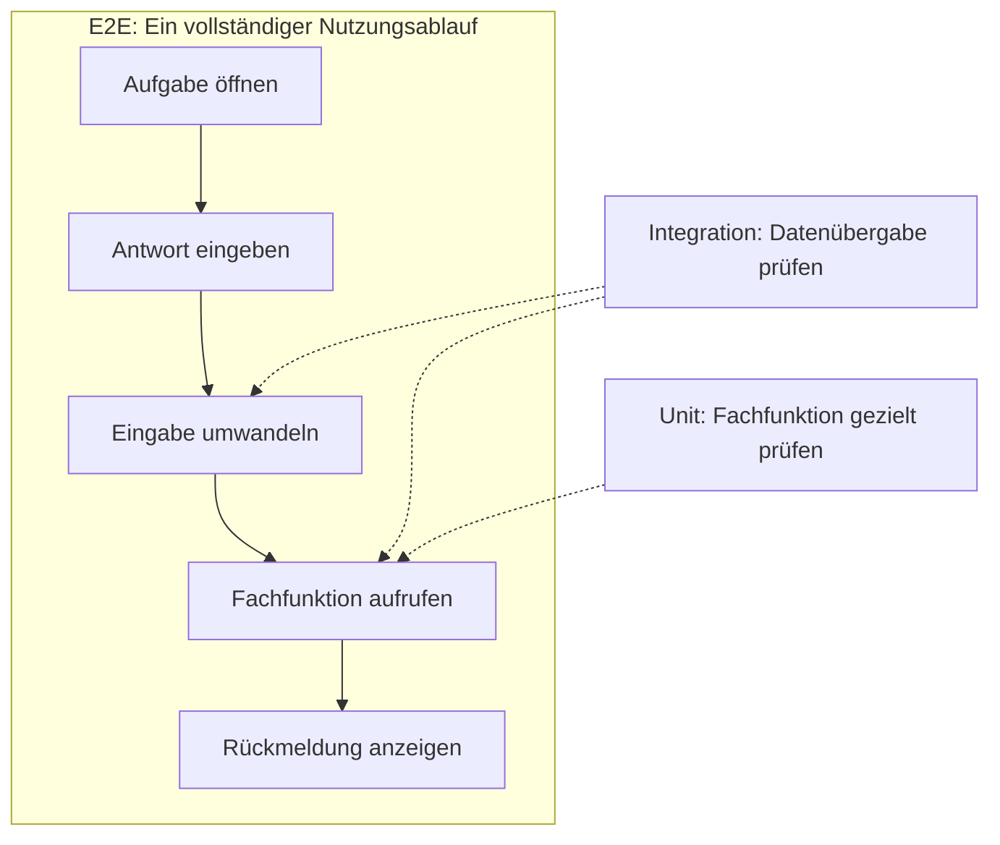
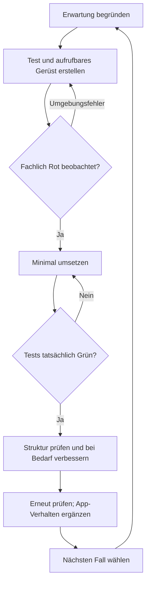

# Vom eigenen Prüffall zur systematischen Qualitätssicherung

## 1. Was immer gilt – und was optional ist

**Verbindlich:** Vor der Umsetzung eine begründete Erwartung festlegen. Nach jedem Task wirklich ausführen und Ergebnis vergleichen. Nach Änderungen betroffene alte Fälle erneut prüfen. Zum Abschluss andere Nutzer ausprobieren lassen.

**Optional:** automatisierte Tests selbst entwickeln, TDD durchführen oder professionelle Werkzeuge kennenlernen. Unit, Integration und E2E sollen zunächst Orientierung bieten. Das Fachgebiet reicht von Testentwurf und Automatisierung bis zu Sicherheit, Bedienbarkeit und Testmanagement.[^istqb]

> [!KONZEPT] Drei unterschiedliche Fragen
> **Was wird geprüft?** Eine Funktion, das Zusammenspiel oder ein kompletter Ablauf. **Wer führt aus?** Ein Mensch oder ein Programm. **Wann entsteht der Test?** Vor, während oder nach der Implementierung. TDD beantwortet die Frage nach dem Entwicklungsverfahren.

## 2. Unit, Integration und E2E an derselben App

Die Beispiele nutzen unseren Trainer mit der festen Aufgabe `1011`. Sie sind Denkbeispiele; es wird kein neues Framework verlangt.

| Blick auf die App | Was wird geprüft? | Beispiel |
| --- | --- | --- |
| **Unit** | Ein kleiner Teil, gezielt für sich[^unit] | `istAntwortRichtig(11)` liefert wahr; `istAntwortRichtig(12)` liefert falsch. |
| **Integration** | Schnittstellen und Zusammenarbeit[^integration] | Eingabetext `"11"` wird korrekt umgewandelt und an die Fachfunktion übergeben. |
| **E2E** | Ein vollständiger Ablauf vom Anfang bis zum Ergebnis | App öffnen, `11` eingeben, klicken und sichtbares „Richtig“ prüfen. |

Ein **Systemtest** betrachtet das gesamte System. E2E bezeichnet einen durchgehenden Ablauf und ist keine zwingende zusätzliche Stufe. Ein **Akzeptanztest** prüft Nutzerbedürfnisse und vereinbarte Kriterien. Das gegenseitige Ausprobieren im Unterricht liefert dafür einfache Anhaltspunkte.[^istqb]

**Denkfrage:** Die Unit-Tests bestehen, auf der Seite erscheint keine Rückmeldung. Was könnten sie übersehen haben? Etwa eine nicht angeschlossene Schaltfläche oder die Anzeige an der falschen Stelle. Der fachliche Kern kann richtig sein, während die Verbindung zur Oberfläche fehlerhaft bleibt.

E2E lässt sich auch automatisieren. Ein Werkzeug wie Playwright kann Seiten öffnen, Eingaben durchführen und sichtbare Ergebnisse prüfen.[^e2e] Für diese Unterrichtseinheit genügt das tatsächliche Ausprobieren durch Schüler.

## 3. Warum Testen ein ganzes Fachgebiet ist

Tests brauchen gute Erwartungen und sinnvolle Fälle. Ein bestandener Test beweist keine vollständige Fehlerfreiheit. Deshalb werden unterschiedliche Prüfungen passend zum Projekt kombiniert.[^istqb]

Weitere Fragen zeigen die fachliche Tiefe:

- **Testentwurf:** Welche Eingaben sind typisch? Welche Werte liegen an Grenzen? Welche Fälle sind gleichartig?
- **Abdeckung:** Welche Anforderungen oder Codezweige erreichen unsere Tests? Was bleibt unberührt?
- **Regression:** Funktioniert das Bisherige nach einer Änderung weiter?
- **Qualitätsmerkmale:** Ist die App verständlich, ausreichend schnell und robust?
- **Testmanagement:** Welche Risiken sind wichtig, welche Prüfungen haben Vorrang?

Die **Testpyramide** ist ein Modell für die Verteilung automatisierter Prüfungen: häufig viele kleine, schnelle Tests und weniger umfassende Abläufe. Sie ist keine feste Zahlenvorgabe. Menschliches Ausprobieren ergänzt automatisierte Prüfungen.[^istqb]

## 4. Optional: TDD praktisch erleben

Test-Driven Development entwickelt Verhalten in kleinen Zyklen: **Test zuerst → Rot → Grün → Refactoring prüfen**.[^tdd] Der Test stellt eine bereits begründete fachliche Erwartung auf die Probe. Im Chat-Frontend führen Schüler selbst aus; die KI wartet jeweils auf das Ergebnis.

Rot bedeutet: Der Test ist lauffähig, scheitert aber am noch fehlenden Verhalten. Syntax- oder Ladefehler werden vorher behoben. Grün bedeutet: die tatsächlich ausgeführten Fälle bestehen. Refactoring verbessert bei Bedarf die Struktur, ohne das Verhalten zu ändern. Ein Test nach bereits fertigem Code ist nachträgliches Testen; ein absichtlich eingebauter Fehler demonstriert Testqualität.

### Ein kleines Beispiel vorbereiten

Die beiliegenden Dateien verwenden eine Temperaturregel: **Warnung nur oberhalb von 30 °C.** Schüler bestimmen für 29, 30 und 31 die Ergebnisse selbst. Dieses Beispiel dient allein dem Testverfahren; anschließend wird es auf eine passende Projektfunktion übertragen.

| Umgebung | Dateien und Start |
| --- | --- |
| Python | `beispiele/tdd/python/app.py` und `test_app.py`; im selben Ordner `python test_app.py`, je nach Schulinstallation `python3` oder `py` |
| Browser | `beispiele/tdd/browser/tests.html`, `app.js`, `tests.js`; Testseite mit vorbereitetem Live Server öffnen; Änderungen speichern und neu laden |

Die Lösung liegt getrennt unter `beispiele/tdd/lehrkraft/`. **Für Schüler nur den gewählten Ordner `python` oder `browser` ausgeben.** Die Ausgangsfunktion ist absichtlich ein Platzhalter. Es werden keine zusätzlichen Pakete benötigt.

Python nutzt ein kleines Prüfskript; das eingebaute Framework `unittest` bleibt ein späterer Ausblick.[^python] Das Browserbeispiel nutzt benannte Funktionen und zeigt die Ausgabe auf der Seite.[^javascript] Fehlerzählung und Browseranbindung sind vorbereitete Infrastruktur.

### Vorschlag für 45 Minuten

| Minuten | Handlung |
| --- | --- |
| 0–8 | Regel und eigene Erwartungen für 29, 30 und 31 klären |
| 8–18 | Gerüst und Tests unterscheiden; tatsächlich starten |
| 18–25 | Rot verstehen: Der Fall 31 scheitert am fehlenden Verhalten |
| 25–35 | Minimale Umsetzung erhalten, speichern und Grün prüfen |
| 35–42 | Struktur besprechen; optional auf einer Kopie `>` durch `>=` ersetzen und Testreaktion beobachten |
| 42–45 | Erklären, welchen Fehler der Grenzwerttest erkennt und was noch ungeprüft ist |

Ist Dateiablage oder Ausführung neu, mehr Zeit einplanen. Die absichtliche Fehländerung ist optional; danach die richtige Fassung wiederherstellen und erneut prüfen.

### Rückmeldung an die KI

:::prompt Tatsächliche Beobachtung berichten
Task: …

Datei und Startverfahren: …

Eingabe und Erwartung: …

Tatsächliche Ausgabe: …

Übernommener Stand: nur Test und Platzhalter / Umsetzung / Strukturänderung.
:::

Bei Browserproblemen zusätzlich Ladefehler in der Konsole prüfen. Fachliche Erwartungen nicht abschwächen, damit ein fehlerhaftes Programm besteht.

## 5. Ein kurzer Transfer reicht

Für die Erprobung wählt die Lehrkraft eine Frage:

- Welche Prüfung untersucht nur die Fachfunktion, welche auch die Oberfläche?
- Warum reicht Grün im Prüfskript für die ganze App noch nicht?
- Was unterscheidet „Erwartung vor Umsetzung“ von einem tatsächlich durchgeführten TDD-Zyklus?

Ziel dieses Ausblicks ist, den Nutzen unterschiedlicher Prüfungen zu erkennen. Eine vollständige professionelle Teststrategie ist kein Unterrichtsauftrag.

[^istqb]: ISTQB, [CTFL Syllabus v4.0.1](https://istqb.org/?download_id=3345&sdm_process_download=1), Abschnitte 1.3, 2.2, 4 und 5.1.6. Begriffliche Orientierung; Schulbeispiele und Unterrichtsablauf sind eigene Vereinfachungen.
[^unit]: Martin Fowler, [Unit Test](https://martinfowler.com/bliki/UnitTest.html). Der Begriff wird in der Praxis unterschiedlich abgegrenzt; hier dient eine kleine Fachfunktion als Einheit.
[^integration]: Martin Fowler, [Integration Test](https://martinfowler.com/bliki/IntegrationTest.html).
[^e2e]: Microsoft, [Playwright: Writing tests](https://playwright.dev/docs/writing-tests), aktuelle technische Primärquelle, geprüft am 04.10.2026.
[^tdd]: Martin Fowler, [Test Driven Development](https://martinfowler.com/bliki/TestDrivenDevelopment.html), aktualisiert 2023; fachlicher Bezug für den Zyklus, kein Nachweis schulischer Lernwirkung.
[^python]: Python, [unittest](https://docs.python.org/3/library/unittest.html), geprüft am 04.10.2026.
[^javascript]: MDN, [Benannte JavaScript-Funktionen](https://developer.mozilla.org/en-US/docs/Web/JavaScript/Reference/Statements/function), geprüft am 04.10.2026.
